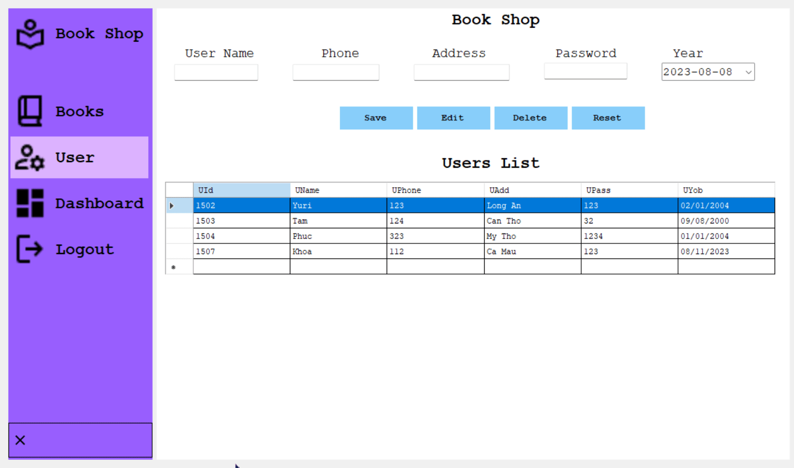
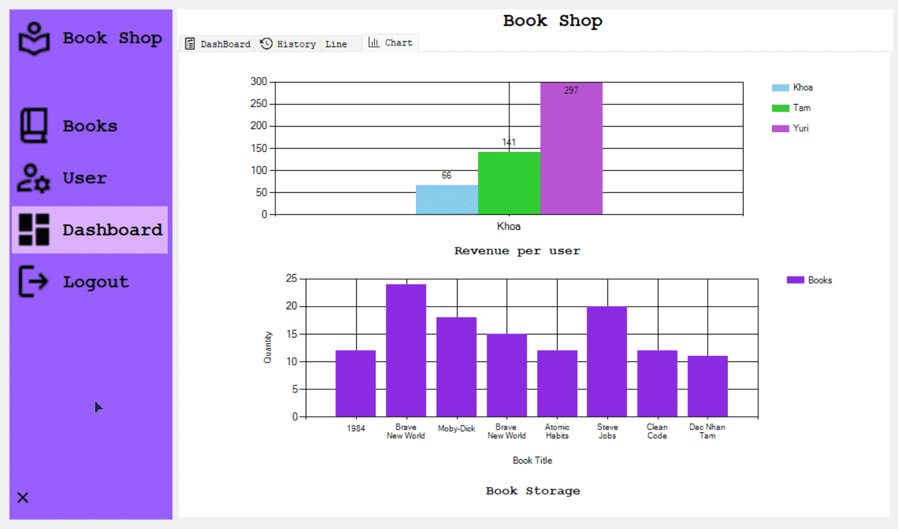

# BookShopManager

## Overview

### Login


User Name: Yuri

- PassWord: 123
- Admin Password: Admin

Download DataBase: https://www.mediafire.com/file/bpm7834v8ozebl3/DataBase_Sql_Server.rar/file

```cs
BookShopDataContext db = new BookShopDataContext();

public static string UserName = "";
private void CheckLogin()
{
    string username = txtUserName.Text;
    string password = txtPassword.Text;

    var user = db.UserTbls.SingleOrDefault(u => u.UName == username && u.UPass == password);

    if (user != null)
    {
        UserName = user.UName;
        Billing obj = new Billing();
        obj.Show();
        this.Hide();
        NotificationHelper.ShowNotification("Login", "Login Successful", ToolTipIcon.Info);
    }
    else
    {
        MessageBox.Show("Wrong Username or Password", "Wrong", MessageBoxButtons.OK, MessageBoxIcon.Warning);
    }
}
// Check Login and Password
private void btnLogin_Click(object sender, EventArgs e)
{
    CheckLogin();
}
```
- Hien Form Admin
```cs
private void label3_Click(object sender, EventArgs e)
{
    AdminLogin obj = new AdminLogin();
    obj.Show();
    this.Hide();
}

```
- An Password

```cs
private void Login_Load(object sender, EventArgs e)
{    
    btnShowPass.ImageIndex = 1;
}
```

```cs
private void btnShowPass_Click(object sender, EventArgs e)
{
    if (txtPassword.PasswordChar == '\0')
    {
        txtPassword.PasswordChar = '*';
        btnShowPass.ImageIndex = 1;
    }
    else
    {
        txtPassword.PasswordChar = '\0';
        btnShowPass.ImageIndex = 0;
    }
}
```

## Login Admin


PassWord: Admin

## Books

- Hien Chu Thi Button khi re chuot toi
```cs
/// <summary>
/// Phuong Thuc Hien Tool Tip cho cac button
/// </summary>
private void ToolTipMain()
{
    ttMain.SetToolTip(btnSearch, "Search");
    ttMain.SetToolTip(btnRefershBooks, "Refresh");
    ttMain.SetToolTip(btnFilterAmountBooks, "Loc Sach theo So luong");
    ttMain.SetToolTip(btnFilterPriceBooks, "Loc Sach Theo Gia");
    if (sort)
        ttMain.SetToolTip(btnSortBook, "Sap Xep Tang Dan");
    else
        ttMain.SetToolTip(btnSortBook, "Sap Xep Giam Dan");
    ttMain.SetToolTip(btnID, "Sap Xep Theo ID");
    ttMain.SetToolTip(btnTitle, "Sap Xep Theo Ten Sach");
    ttMain.SetToolTip(btnAuthor, "Sap Xep Theo Tac Gia");
    ttMain.SetToolTip(btnCategory, "Sap Xep Theo The Loai");
    ttMain.SetToolTip(btnYear, "Sap Xep Theo Nam");
    ttMain.SetToolTip(btnPrice, "Sap Xep Theo Gia");
    ttMain.SetToolTip(btnQty, "Sap Xep Theo So Luong");
}
public frmBooks()
{
    InitializeComponent();
    showDataBase();
}

```
- Khoi tao Chuoi ket Noi
```cs
///khoi tao ket noi linQ
BookShopDataContext db = new BookShopDataContext();

```
```cs
/// <summary>
/// phuong thuc dinh dang lai dataview 
/// </summary>
private void AutoSizeData()
{
    dvBooks.AutoSizeColumnsMode = DataGridViewAutoSizeColumnsMode.AllCells;
    dvBooks.AutoSizeRowsMode = DataGridViewAutoSizeRowsMode.AllCells;

    dvFilterBooks.AutoSizeRowsMode = DataGridViewAutoSizeRowsMode.AllCells;
    dvFilterBooks.AutoSizeColumnsMode = DataGridViewAutoSizeColumnsMode.AllCells;
}
```

- Tao Co Danh Dau Tim Kiem
```cs
//tao co cho button sort
bool sort = true;
private void frmBooks_Load(object sender, EventArgs e)
{
    //Hien thi du lieu
    showDataBase();

    //Dinh dang lai bang
    AutoSizeData();

    //Dua cac the loai sach vao cac combox
    foreach (var item in CBooks.Cate)
    {
        cbCate.Items.Add(item);
        cbFilerBook.Items.Add(item);
    }

    //Hien Thong tin toolTip
    ToolTipMain();
    sort = true;
}
```

- Hien thi Co So Du Lieu Vao DatagridView
```cs
/// <summary>
/// Phuong Thuc Hien Shơ Database bang LinQ to SQL
/// </summary>
private void showDataBase()
{
    dvFilterBooks.DataSource = db.BookTbls.Select(p => p);
    dvBooks.DataSource = db.BookTbls.Select(p => p);
}

```

- Them Sach Vao dataview
```cs
/// <summary>
/// Them Sach Vao DataView
/// </summary>
private void AddBook()
{
    if (txtTitle.Text == "" || txtAuthor.Text == "" || txtQty.Value == 0 || txtPrice.Value == 0 || cbCate.SelectedIndex == -1)
    {
        NotificationHelper.ShowNotification("Miss", "Missing Infor Books", ToolTipIcon.Info);
    }
    else
    {
        //tao lop de chen du lieu vao database
        BookTbl insert = new BookTbl();

        CBooks books = new CBooks()
        {
            Title = txtTitle.Text,
            Author = txtAuthor.Text,
            Category = cbCate.SelectedItem.ToString(),
            Qty = Convert.ToInt32(txtQty.Value),
            Price = Convert.ToInt32(txtPrice.Value),
            Year = Convert.ToInt32(mmYear.Value)
        };

        insert.BTitle = books.Title;
        insert.BAuthor = books.Author;
        insert.BCat = books.Category;
        insert.BQty = books.Qty;
        insert.BPrice = books.Price;
        insert.BYear = books.Year;

        db.BookTbls.InsertOnSubmit(insert); // Chen du lieu vao database
        db.SubmitChanges(); //Luu thay doi vao data base
        NotificationHelper.ShowNotification("Success", "Book Save Successfully", ToolTipIcon.Info);
    }
}
```
- Reset Lai Cac TextBox
```cs
/// <summary>
/// Phuong Thuc Reset lai Cac textbox
/// </summary>
private void RestColum()
{
    txtTitle.Text = "";
    txtAuthor.Text = "";
    cbCate.SelectedIndex = -1;
    txtQty.Value = 0;
    txtPrice.Value = 0;
}
private void btnReset_Click(object sender, EventArgs e)
{
    RestColum();
    showDataBase();
    cbFilerBook.SelectedIndex = -1;
}
```
-  Hien Thi Sach
```cs
/// <summary>
/// Phuong Thuc Hien Thi Dua lieu tu DataView len cac truong du lieu
/// </summary>
private void DisplaySelectedBookDetails()
{
    txtTitle.Text = dvBooks.SelectedRows[0].Cells[1].Value.ToString();
    txtAuthor.Text = dvBooks.SelectedRows[0].Cells[2].Value.ToString();
    cbCate.SelectedItem = dvBooks.SelectedRows[0].Cells[3].Value.ToString();
    txtQty.Value = Convert.ToInt32(dvBooks.SelectedRows[0].Cells[4].Value.ToString());
    txtPrice.Value = Convert.ToInt32(dvBooks.SelectedRows[0].Cells[5].Value.ToString());
    mmYear.Value = Convert.ToInt32(dvBooks.SelectedRows[0].Cells[6].Value.ToString());
}
private void dvBooks_CellContentClick(object sender, DataGridViewCellEventArgs e)
{
    DisplaySelectedBookDetails();
}

```
- Xoa Sach Khi Chon
```cs
/// <summary>
/// Phuong Thuc Xoa Cuon Sach khi chon vao cuon do
/// </summary>
private void DeleteBook()
{
    if (dvBooks.SelectedRows.Count > 0)
    {
        //lay id khi nhan vao 1 hang cua bang
        string id = dvBooks.SelectedCells[0].OwningRow.Cells["BId"].Value.ToString();
        BookTbl delete = db.BookTbls.Where(p => p.BId.Equals(id)).FirstOrDefault(); // First or Default: lay gia tri dau tien nieu khog thi null

        db.BookTbls.DeleteOnSubmit(delete);
        db.SubmitChanges(); //Luu Database sau khi xoa
    }
}
private void btnDelet_Click(object sender, EventArgs e)
{
    DeleteBook();
    showDataBase();
}

```
- Edit Sach
```cs
private void EditBook()
{
    string id = dvBooks.SelectedCells[0].OwningRow.Cells["BId"].Value.ToString();

    BookTbl edit = db.BookTbls.Where(p => p.BId.Equals(id)).FirstOrDefault(); // First or Default: lay gia tri dau tien nieu khog thi null

    edit.BTitle = txtTitle.Text;
    edit.BAuthor = txtAuthor.Text;
    edit.BCat = cbCate.SelectedItem.ToString();
    edit.BQty = Convert.ToInt32(txtQty.Value);
    edit.BPrice = Convert.ToInt32(txtPrice.Value);
    edit.BYear = Convert.ToInt32(mmYear.Value);

    db.SubmitChanges(); //Luu Database sau khi xoa
}

private void btnEdit_Click(object sender, EventArgs e)
{
    EditBook();
}
private void btnRefershBooks_Click(object sender, EventArgs e)
{
    showDataBase();
    sort = true;
    btnSortBook.Text = "Az";
}

```

- Tim Kiem Sach
```cs
/// <summary>
/// Phuong Thuc Tim Sach
/// </summary>
private void SearchBook()
{
    if (cbFieldSearchBook.SelectedItem != null && !string.IsNullOrEmpty(txtSearchBox.Text))
    {
        string selectedValue = cbFieldSearchBook.SelectedItem.ToString();
        switch (selectedValue)
        {
            case "ID":
                dvFilterBooks.DataSource = db.BookTbls.Where(p => p.BId.Equals(txtSearchBox.Text)).ToList();
                break;
            case "Title":
                dvFilterBooks.DataSource = db.BookTbls.Where(p => p.BTitle.Equals(txtSearchBox.Text)).ToList();
                break;
            case "Author":
                dvFilterBooks.DataSource = db.BookTbls.Where(p => p.BAuthor.Equals(txtSearchBox.Text)).ToList();
                break;
            case "Qty":
                dvFilterBooks.DataSource = db.BookTbls.Where(p => p.BQty.Equals(txtSearchBox.Text)).ToList();
                break;
            case "Price":
                dvFilterBooks.DataSource = db.BookTbls.Where(p => p.BPrice.Equals(txtSearchBox.Text)).ToList();
                break;
            case "Year":
                dvFilterBooks.DataSource = db.BookTbls.Where(p => p.BYear.Equals(txtSearchBox.Text)).ToList();
                break;
            default:
                NotificationHelper.ShowNotification("Error", "Book Not Found", ToolTipIcon.Error);
                break;
        }
    }
    else
    {
        NotificationHelper.ShowNotification("Error", "Book Not Found", ToolTipIcon.Error);
    }
}
```

- Loc Sach Theo gia
```cs
/// <summary>
/// Phuong Thuc Loc Sach Theo Gia
/// </summary>
private void FilterPriceBook()
{
    int min = Convert.ToInt32(mmToPrice.Value);
    int max = Convert.ToInt32(mmFromPrice.Value);

    dvFilterBooks.DataSource = db.BookTbls.Where(pv => pv.BPrice >= min && pv.BPrice <= max).ToList();
}
```
- Loc Sach Theo So Luong
```cs
/// <summary>
/// Phuong Thuc Loc Sach Theo So Luong
/// </summary>
private void FilterAmountBook()
{
    int min = Convert.ToInt32(mmToAmount.Value);
    int max = Convert.ToInt32(mmFromAmount.Value);

    dvFilterBooks.DataSource = db.BookTbls.Where(pv => pv.BQty >= min && pv.BQty <= max).ToList();
}
```

- Loc Sach Theo The Loai
```cs
/// <summary>
/// Ham Loc Sach Theo The loai
/// </summary>
private void FilterCategory()
{
    if (cbFilerBook.SelectedItem == "All")
    {
        //populate();
        showDataBase();
        return;
    }
    string cate = cbFilerBook.SelectedItem.ToString();
    dvFilterBooks.DataSource = db.BookTbls.Where(p => p.BCat.Equals(cate));
}
```

- Loc Sach 
```cs
private void cbFilerBooka_SelectedIndexChanged(object sender, EventArgs e)
{
    FilterCategory();
}
private void btnFilterPriceBooks_Click(object sender, EventArgs e)
{
    FilterPriceBook();
}
private void btnFilterAmountBooks_Click(object sender, EventArgs e)
{
    FilterAmountBook();
}
```


### Edits Books


### Filter Add Search Books


//Xap xep sach theo tung danh muc
```cs
private void btnSortBook_Click(object sender, EventArgs e)
{
    if (sort)
    {
        btnSortBook.Text = "Za";
        sort = false;
    }
    else
    {
        btnSortBook.Text = "Az";
        sort = true;
    }

}
private void btnID_Click(object sender, EventArgs e)
{
    if (sort)
        dvFilterBooks.DataSource = db.BookTbls.OrderBy(p => p.BId).ToList();
    else
        dvFilterBooks.DataSource = db.BookTbls.OrderByDescending(p => p.BId).ToList();
}
private void btnTitle_Click(object sender, EventArgs e)
{
    if (sort)
        dvFilterBooks.DataSource = db.BookTbls.OrderBy(p => p.BTitle).ToList();
    else
        dvFilterBooks.DataSource = db.BookTbls.OrderByDescending(p => p.BTitle).ToList();
}
private void btnAuthor_Click(object sender, EventArgs e)
{

    if (sort)
        dvFilterBooks.DataSource = db.BookTbls.OrderBy(p => p.BAuthor).ToList();
    else
        dvFilterBooks.DataSource = db.BookTbls.OrderByDescending(p => p.BAuthor).ToList();
}
private void btnCategory_Click(object sender, EventArgs e)
{

    if (sort)
        dvFilterBooks.DataSource = db.BookTbls.OrderBy(p => p.BCat).ToList();
    else
        dvFilterBooks.DataSource = db.BookTbls.OrderByDescending(p => p.BCat).ToList();
}

private void btnYear_Click(object sender, EventArgs e)
{
    if (sort)
        dvFilterBooks.DataSource = db.BookTbls.OrderBy(p => p.BYear).ToList();
    else
        dvFilterBooks.DataSource = db.BookTbls.OrderByDescending(p => p.BYear).ToList();
}
private void btnQty_Click(object sender, EventArgs e)
{

    if (sort)
        dvFilterBooks.DataSource = db.BookTbls.OrderBy(p => p.BQty).ToList();
    else
        dvFilterBooks.DataSource = db.BookTbls.OrderByDescending(p => p.BQty).ToList();
}

private void btnPrice_Click(object sender, EventArgs e)
{
    if (sort)
        dvFilterBooks.DataSource = db.BookTbls.OrderBy(p => p.BPrice).ToList();
    else
        dvFilterBooks.DataSource = db.BookTbls.OrderByDescending(p => p.BPrice).ToList();
}

```

#### Filter


#### Sort


## User
- Them User
```cs
private void addUser()
{
    if (txtUser.Text == "" || txtPassword.Text == "" || txtPhone.Text == "" || txtAddress.Text == "" || dtYob.Value == null)
    {
        NotificationHelper.ShowNotification("Miss", "Missing Infor User", ToolTipIcon.Info);
    }
    else
    {
        UserTbl user = new UserTbl();

        user.UName = txtUser.Text.Trim();
        user.UPass = txtPassword.Text.Trim();
        user.UPhone = txtPhone.Text.Trim();
        user.UAdd = txtAddress.Text.Trim();
        user.UYob = dtYob.Value;

        db.UserTbls.InsertOnSubmit(user);
        db.SubmitChanges();
        NotificationHelper.ShowNotification("Success", "Add User Success", ToolTipIcon.Info);

        ShowDataBaseUser();
    }
}
```

- DeleteUser
```cs
private void DeleteUser()
{
    if (dvUser.SelectedRows.Count == 0)
        return;
    string id = dvUser.SelectedCells[0].OwningRow.Cells["UId"].Value.ToString();
    UserTbl delete = db.UserTbls.Where(p => p.UId.Equals(id)).FirstOrDefault();
    db.UserTbls.DeleteOnSubmit(delete);
    db.SubmitChanges();
}

```

- Show Thong Tin Nguoi dung Khi Nhan Vao
```cs
/// <summary>
/// Hien thi thong tin nguoi dung khi nhan vao ban
/// </summary>
private void DisplaySelectedUserDetails()
{
    txtUser.Text = dvUser.SelectedRows[0].Cells[1].Value.ToString();
    txtPhone.Text = dvUser.SelectedRows[0].Cells[2].Value.ToString();
    txtAddress.Text = dvUser.SelectedRows[0].Cells[3].Value.ToString();
    txtPassword.Text = dvUser.SelectedRows[0].Cells[4].Value.ToString();
    string dateString = dvUser.SelectedRows[0].Cells[5].Value.ToString();
    if (DateTime.TryParse(dateString, out DateTime date))
        dtYob.Value = date;
}
private void dvUser_CellContentClick(object sender, DataGridViewCellEventArgs e)
{
    DisplaySelectedUserDetails();
}
```

- Edit User Details
```cs
private void EditUser()
{
    string id = dvUser.SelectedCells[0].OwningRow.Cells["UId"].Value.ToString();
    UserTbl user = db.UserTbls.Where(p => p.UId.Equals(id)).FirstOrDefault();

    user.UName = txtUser.Text;
    user.UPass = txtPassword.Text;
    user.UPhone = txtPhone.Text;
    user.UAdd = txtAddress.Text;
    user.UYob = dtYob.Value;

    db.SubmitChanges();
}
```




## Dashboard

### Dashboard


```cs
//Tao doi tuong truy van vao CSDL
BookShopDataContext db = new BookShopDataContext();

private void Dashboard_Load(object sender, EventArgs e)
{
    CardView();

    ChartLichSuGiaoDich();
    ChartSoLuongSachConLaiTrongKho();
    ChartDoanhThuTungNhaVien();
}
```


```c
private void CardView()
{
    //So luong Sach Con Trong Kho
    var totalStock = db.BookTbls.Sum(b => b.BQty);
    lbBooksStock.Text = totalStock.ToString();

    //Tong Doanh Thu
    var totalAmount = db.BillTbls.Sum(b => b.Amount);
    lbToTalAmount.Text = totalAmount.ToString();

    //So luong Nhan Vien
    var userCount = db.UserTbls.Count();
    lbUsers.Text = userCount.ToString();

    //doanh Thu cao nhat
    var maxAmount = db.BillTbls.Max(b => b.Amount);
    lbMost.Text = maxAmount.ToString();
}
```


### History


```cs
//datagridview lish su giao dich
dvHistory.DataSource = db.BillTbls.Select(p => p);
```

### Line


```c
private void ChartLichSuGiaoDich()
{
    // Chart Bill
    var billData = db.BillTbls.Select(b => new { UName = b.UName, Amount = b.Amount }).ToList();

    //Xoa Tat Ca Du Lieu Hien Co Ten Ban
    cInCome.Series.Clear();

    //Tao dai du lieu BillData
    Series series1 = new Series("BillData");
    //Xac dinh truc x, y cho du lieu
    series1.XValueMember = "UName";
    series1.YValueMembers = "Amount";

    series1.ToolTip = "#VALX: #VAL";
    //Dung Bieu Do chart
    series1.ChartType = SeriesChartType.Line;

    //Them du lieu vao bieu do
    cInCome.Series.Add(series1);

    //Them nguon Du lieu
    cInCome.DataSource = billData;

    //Hien Thi Bieu Do
    cInCome.DataBind();
}
```

### Chart


- Bieu Do the hien doanh thu cua tung nguoi

```cs
/// <summary>
/// Bieu Do Co doanh Thu cua tung nguoi 
/// </summary>
private void ChartDoanhThuTungNhaVien()
{
    //Xoa tat ca du lieu truoc do
    cRevenuePerUser.Series.Clear();

    //Cho mau bieu do
    cRevenuePerUser.Palette = ChartColorPalette.Pastel;

    //Lay Doanh Thu Tu nguoi Tu co so du lieu
    var userAmountData = db.BillTbls
        .GroupBy(b => b.UName)
        .Select(g => new
        {
            UName = g.Key,
            TotalAmount = g.Sum(b => b.Amount)
        })
        .ToList();

    //duyen tung nguoi dung va theo cok CSDL 
    foreach (var item in userAmountData)
    {
        string uname = item.UName;

        Series seriesItem = new Series(uname);
        seriesItem.Points.AddXY(uname, item.TotalAmount);
        seriesItem.IsValueShownAsLabel = true;
        cRevenuePerUser.Series.Add(seriesItem);
        seriesItem.Points.Last().ToolTip = uname;
    }
}
```

- So Luong Sach Con Lai Trong Kho

  ```c
  private void ChartSoLuongSachConLaiTrongKho()
  {
      // Chart Books
      //Lay Ten Sach Va So Luong Con Lai Trong Sach
      var bookData = db.BookTbls.Select(b => new { BTitle = b.BTitle, BQty = b.BQty }).ToList();
  
      //Gan nguon Du lieu
      cBookStorage.DataSource = bookData;
  
      cBookStorage.Series.Clear();
  
      Series series = new Series("Books");
      series.ChartType = SeriesChartType.Column;
  
      series.XValueMember = "BTitle";
      series.YValueMembers = "BQty";
  
      cBookStorage.Series.Add(series);
  
      cBookStorage.ChartAreas[0].AxisX.Title = "Book Title";
      cBookStorage.ChartAreas[0].AxisY.Title = "Quantity";
  
      //Hien Thi Du Lieu
      cBookStorage.DataBind();
  
  }
  ```

## Bill




```cs

public Billing()
{
    InitializeComponent();
    //populate();
    ShowBook();
}

private void Billing_Load(object sender, EventArgs e)
{
    lbUserName.Text = frmLogin.UserName;
    dvBill.AutoSizeColumnsMode = DataGridViewAutoSizeColumnsMode.AllCells;
    dvBooks.AutoSizeColumnsMode = DataGridViewAutoSizeColumnsMode.AllCells;
}
//SqlConnection con = new SqlConnection(
//    @"Data Source=LAPTOP-59C9UNMJ\KI;Initial Catalog=BOOKSHOPSDB;Integrated Security=True");
BookShopDataContext db = new BookShopDataContext();

private void ShowBook()
{
    dvBooks.DataSource = db.BookTbls;
}
private void UpdateBook()
{
    int newQty = stock - Convert.ToInt32(txtQty.Value);
    var bookToUpdate = db.BookTbls.SingleOrDefault(b => b.BId == key);

    if (bookToUpdate != null)
    {
        bookToUpdate.BQty = newQty;
        db.SubmitChanges();
        ShowBook();
    }
}
int n = 0, GrdTotal = 0;

private void btnSave_Click(object sender, EventArgs e)
{
    if (txtQty.Value == 0 || Convert.ToInt32(txtQty.Value) > stock)
    {
        MessageBox.Show("No Enough Stock");
    }
    else
    {
        int total = Convert.ToInt32(txtQty.Value) * Convert.ToInt32(txtPrice.Value);
        DataGridViewRow newRow = new DataGridViewRow();
        newRow.CreateCells(dvBill);
        newRow.Cells[0].Value = n + 1;
        newRow.Cells[1].Value = txtTitle.Text.Trim();
        newRow.Cells[2].Value = txtQty.Value;
        newRow.Cells[3].Value = txtPrice.Value;
        newRow.Cells[4].Value = total;
        dvBill.Rows.Add(newRow);
        n++;
        UpdateBook();
        GrdTotal = GrdTotal + total;
        lbTotal.Text = "Total $: " + GrdTotal;
    }
}

int key = 0, stock = 0;

private void dvBooks_CellContentClick(object sender, DataGridViewCellEventArgs e)
{
    //reset bill
    btnReset_Click(sender, e);
    txtTitle.Text = dvBooks.SelectedRows[0].Cells[1].Value.ToString();
    txtPrice.Value = decimal.Parse(dvBooks.SelectedRows[0].Cells[5].Value.ToString());

    if (txtTitle.Text == "")
    {
        key = 0;
        stock = 0;
    }
    else
    {
        key = Convert.ToInt32(dvBooks.SelectedRows[0].Cells[0].Value.ToString());
        stock = Convert.ToInt32(dvBooks.SelectedRows[0].Cells[4].Value.ToString());
    }
}
 
```

### Print

```cs
private void PrintBill()
{
    // Tạo một đối tượng hóa đơn mới
    BillTbl newBill = new BillTbl
    {
        UName = lbUserName.Text,
        ClineName = txtClientName.Text,
        Amount = GrdTotal,
        UDate = DateTime.Now
    };

    // Thêm hóa đơn vào cơ sở dữ liệu bằng LINQ to SQL
    db.BillTbls.InsertOnSubmit(newBill);
    db.SubmitChanges();

    // Hiển thị thông báo hoặc thực hiện các công việc cần thiết sau khi thêm hóa đơn thành công
    NotificationHelper.ShowNotification("Bill", "Bill Saved Successfully", ToolTipIcon.Info);


    printDocument1.DefaultPageSettings.PaperSize = new System.Drawing.Printing.PaperSize("pprnm", 600, 800);

    printPreviewDialog1.PointToScreen(Cursor.Position);
    if (printPreviewDialog1.ShowDialog() == DialogResult.OK)
        printDocument1.Print();
}
```


```cs
int prodid, prodqty, prodprice, tottal, pos = 60;
string prodname;
private void printDocument1_PrintPage(object sender, System.Drawing.Printing.PrintPageEventArgs e)
        {
            e.Graphics
                .DrawString("      Book Shop", new Font("Courier New", 18, FontStyle.Bold), Brushes.Blue, new Point(80, 15));
            e.Graphics
                .DrawString(
                    "ID PRODUCT            PRICE QTY TOTAL",
                    new Font("Courier New", 9, FontStyle.Bold),
                    Brushes.Blue,
                    new Point(26, 40));
            foreach (DataGridViewRow row in dvBill.Rows)
            {
                prodid = Convert.ToInt32(row.Cells["Column1"].Value);
                prodname = "" + row.Cells["Column2"].Value;
                prodprice = Convert.ToInt32(row.Cells["Column3"].Value);
                prodqty = Convert.ToInt32(row.Cells["Column4"].Value);
                //tottal = Convert.ToInt32(row.Cells[row.Cells["Column5"].Value);
                tottal = Convert.ToInt32(row.Cells["Column5"].Value);
                e.Graphics
                    .DrawString(
                        "" + prodid,
                        new Font("Courier New", 9, FontStyle.Bold),
                        Brushes.Black,
                        new Point(26, pos));
                e.Graphics
                    .DrawString(
                        "" + prodname,
                        new Font("Courier New", 9, FontStyle.Bold),
                        Brushes.Black,
                        new Point(45, pos));
                e.Graphics
                    .DrawString(
                        "" + prodprice,
                        new Font("Courier New", 9, FontStyle.Bold),
                        Brushes.Black,
                        new Point(200, pos));
                e.Graphics
                    .DrawString(
                        "" + prodqty,
                        new Font("Courier New", 9, FontStyle.Bold),
                        Brushes.Black,
                        new Point(230, pos));
                e.Graphics
                    .DrawString(
                        "" + tottal,
                        new Font("Courier New", 9, FontStyle.Bold),
                        Brushes.Black,
                        new Point(265, pos));
                pos = pos + 20;
            }
            e.Graphics
                .DrawString(
                    "       Grand ToTal: $" + GrdTotal,
                    new Font("Courier New", 12, FontStyle.Bold),
                    Brushes.Blue,
                    new Point(60, pos + 50));
            e.Graphics
                .DrawString(
                    "       =========== BookStore ===========",
                    new Font("Courier New", 10, FontStyle.Bold),
                    Brushes.Blue,
                    new Point(40, pos + 85));
            dvBill.Rows.Clear();
            dvBill.Refresh();
            pos = 100;
            GrdTotal = 0;
    }
```


