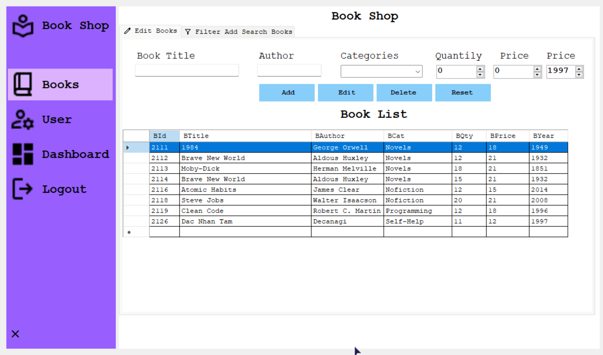
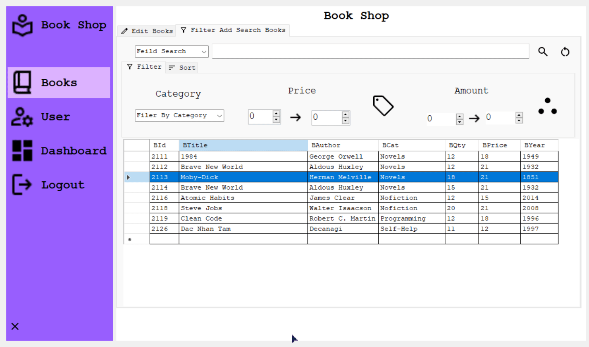
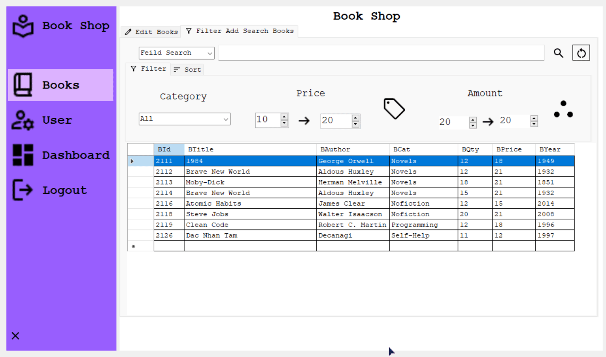

# BookShopManager

## Overview

### Login


User Name: Yuri

- PassWord: 123
- Admin Password: Admin

```cs
BookShopDataContext db = new BookShopDataContext();

public static string UserName = "";
private void CheckLogin()
{
    string username = txtUserName.Text;
    string password = txtPassword.Text;

    var user = db.UserTbls.SingleOrDefault(u => u.UName == username && u.UPass == password);

    if (user != null)
    {
        UserName = user.UName;
        Billing obj = new Billing();
        obj.Show();
        this.Hide();
        NotificationHelper.ShowNotification("Login", "Login Successful", ToolTipIcon.Info);
    }
    else
    {
        MessageBox.Show("Wrong Username or Password", "Wrong", MessageBoxButtons.OK, MessageBoxIcon.Warning);
    }
}
// Check Login and Password
private void btnLogin_Click(object sender, EventArgs e)
{
    CheckLogin();
}
```
- Hien Form Admin
```cs
private void label3_Click(object sender, EventArgs e)
{
    AdminLogin obj = new AdminLogin();
    obj.Show();
    this.Hide();
}

```
- An Password

```cs
private void Login_Load(object sender, EventArgs e)
{    
    btnShowPass.ImageIndex = 1;
}
```

```cs
private void btnShowPass_Click(object sender, EventArgs e)
{
    if (txtPassword.PasswordChar == '\0')
    {
        txtPassword.PasswordChar = '*';
        btnShowPass.ImageIndex = 1;
    }
    else
    {
        txtPassword.PasswordChar = '\0';
        btnShowPass.ImageIndex = 0;
    }
}
```

## Login Admin


PassWord: Admin

## Books

- Hien Chu Thi Button khi re chuot toi
```cs
/// <summary>
/// Phuong Thuc Hien Tool Tip cho cac button
/// </summary>
private void ToolTipMain()
{
    ttMain.SetToolTip(btnSearch, "Search");
    ttMain.SetToolTip(btnRefershBooks, "Refresh");
    ttMain.SetToolTip(btnFilterAmountBooks, "Loc Sach theo So luong");
    ttMain.SetToolTip(btnFilterPriceBooks, "Loc Sach Theo Gia");
    if (sort)
        ttMain.SetToolTip(btnSortBook, "Sap Xep Tang Dan");
    else
        ttMain.SetToolTip(btnSortBook, "Sap Xep Giam Dan");
    ttMain.SetToolTip(btnID, "Sap Xep Theo ID");
    ttMain.SetToolTip(btnTitle, "Sap Xep Theo Ten Sach");
    ttMain.SetToolTip(btnAuthor, "Sap Xep Theo Tac Gia");
    ttMain.SetToolTip(btnCategory, "Sap Xep Theo The Loai");
    ttMain.SetToolTip(btnYear, "Sap Xep Theo Nam");
    ttMain.SetToolTip(btnPrice, "Sap Xep Theo Gia");
    ttMain.SetToolTip(btnQty, "Sap Xep Theo So Luong");
}
public frmBooks()
{
    InitializeComponent();
    showDataBase();
}

```
- Khoi tao Chuoi ket Noi
```cs
///khoi tao ket noi linQ
BookShopDataContext db = new BookShopDataContext();

```
```cs
/// <summary>
/// phuong thuc dinh dang lai dataview 
/// </summary>
private void AutoSizeData()
{
    dvBooks.AutoSizeColumnsMode = DataGridViewAutoSizeColumnsMode.AllCells;
    dvBooks.AutoSizeRowsMode = DataGridViewAutoSizeRowsMode.AllCells;

    dvFilterBooks.AutoSizeRowsMode = DataGridViewAutoSizeRowsMode.AllCells;
    dvFilterBooks.AutoSizeColumnsMode = DataGridViewAutoSizeColumnsMode.AllCells;
}
```

- Tao Co Danh Dau Tim Kiem
```cs
//tao co cho button sort
bool sort = true;
private void frmBooks_Load(object sender, EventArgs e)
{
    //Hien thi du lieu
    showDataBase();

    //Dinh dang lai bang
    AutoSizeData();

    //Dua cac the loai sach vao cac combox
    foreach (var item in CBooks.Cate)
    {
        cbCate.Items.Add(item);
        cbFilerBook.Items.Add(item);
    }

    //Hien Thong tin toolTip
    ToolTipMain();
    sort = true;
}
```

- Hien thi Co So Du Lieu Vao DatagridView
```cs
/// <summary>
/// Phuong Thuc Hien Shơ Database bang LinQ to SQL
/// </summary>
private void showDataBase()
{
    dvFilterBooks.DataSource = db.BookTbls.Select(p => p);
    dvBooks.DataSource = db.BookTbls.Select(p => p);
}

```

- Them Sach Vao dataview
```cs
/// <summary>
/// Them Sach Vao DataView
/// </summary>
private void AddBook()
{
    if (txtTitle.Text == "" || txtAuthor.Text == "" || txtQty.Value == 0 || txtPrice.Value == 0 || cbCate.SelectedIndex == -1)
    {
        NotificationHelper.ShowNotification("Miss", "Missing Infor Books", ToolTipIcon.Info);
    }
    else
    {
        //tao lop de chen du lieu vao database
        BookTbl insert = new BookTbl();

        CBooks books = new CBooks()
        {
            Title = txtTitle.Text,
            Author = txtAuthor.Text,
            Category = cbCate.SelectedItem.ToString(),
            Qty = Convert.ToInt32(txtQty.Value),
            Price = Convert.ToInt32(txtPrice.Value),
            Year = Convert.ToInt32(mmYear.Value)
        };

        insert.BTitle = books.Title;
        insert.BAuthor = books.Author;
        insert.BCat = books.Category;
        insert.BQty = books.Qty;
        insert.BPrice = books.Price;
        insert.BYear = books.Year;

        db.BookTbls.InsertOnSubmit(insert); // Chen du lieu vao database
        db.SubmitChanges(); //Luu thay doi vao data base
        NotificationHelper.ShowNotification("Success", "Book Save Successfully", ToolTipIcon.Info);
    }
}
private void btnSave_Click(object sender, EventArgs e)
{
    AddBook();
    showDataBase();
}
```
- Reset Lai Cac TextBox
```cs
/// <summary>
/// Phuong Thuc Reset lai Cac textbox
/// </summary>
private void RestColum()
{
    txtTitle.Text = "";
    txtAuthor.Text = "";
    cbCate.SelectedIndex = -1;
    txtQty.Value = 0;
    txtPrice.Value = 0;
}
private void btnReset_Click(object sender, EventArgs e)
{
    RestColum();
    showDataBase();
    cbFilerBook.SelectedIndex = -1;
}
```
-  Hien Thi Sach
```cs
/// <summary>
/// Phuong Thuc Hien Thi Dua lieu tu DataView len cac truong du lieu
/// </summary>
private void DisplaySelectedBookDetails()
{
    txtTitle.Text = dvBooks.SelectedRows[0].Cells[1].Value.ToString();
    txtAuthor.Text = dvBooks.SelectedRows[0].Cells[2].Value.ToString();
    cbCate.SelectedItem = dvBooks.SelectedRows[0].Cells[3].Value.ToString();
    txtQty.Value = Convert.ToInt32(dvBooks.SelectedRows[0].Cells[4].Value.ToString());
    txtPrice.Value = Convert.ToInt32(dvBooks.SelectedRows[0].Cells[5].Value.ToString());
    mmYear.Value = Convert.ToInt32(dvBooks.SelectedRows[0].Cells[6].Value.ToString());
}
private void dvBooks_CellContentClick(object sender, DataGridViewCellEventArgs e)
{
    DisplaySelectedBookDetails();
}

```
- Xoa Sach Khi Chon
```cs
/// <summary>
/// Phuong Thuc Xoa Cuon Sach khi chon vao cuon do
/// </summary>
private void DeleteBook()
{
    if (dvBooks.SelectedRows.Count > 0)
    {
        //lay id khi nhan vao 1 hang cua bang
        string id = dvBooks.SelectedCells[0].OwningRow.Cells["BId"].Value.ToString();
        BookTbl delete = db.BookTbls.Where(p => p.BId.Equals(id)).FirstOrDefault(); // First or Default: lay gia tri dau tien nieu khog thi null

        db.BookTbls.DeleteOnSubmit(delete);
        db.SubmitChanges(); //Luu Database sau khi xoa
    }
}
private void btnDelet_Click(object sender, EventArgs e)
{
    DeleteBook();
    showDataBase();
}

```
- Edit Sach
```cs
private void EditBook()
{
    string id = dvBooks.SelectedCells[0].OwningRow.Cells["BId"].Value.ToString();

    BookTbl edit = db.BookTbls.Where(p => p.BId.Equals(id)).FirstOrDefault(); // First or Default: lay gia tri dau tien nieu khog thi null

    edit.BTitle = txtTitle.Text;
    edit.BAuthor = txtAuthor.Text;
    edit.BCat = cbCate.SelectedItem.ToString();
    edit.BQty = Convert.ToInt32(txtQty.Value);
    edit.BPrice = Convert.ToInt32(txtPrice.Value);
    edit.BYear = Convert.ToInt32(mmYear.Value);

    db.SubmitChanges(); //Luu Database sau khi xoa
}

private void btnEdit_Click(object sender, EventArgs e)
{
    EditBook();
}

//Hien form Users
private void label6_Click(object sender, EventArgs e)
{
    frmUsers obj = new frmUsers();
    obj.Show();
    this.Hide();
}

//Hien form Dashboard
private void label7_Click(object sender, EventArgs e)
{
    frmDashboard obj = new frmDashboard();
    obj.Show();
    this.Hide();
}

private void label8_Click(object sender, EventArgs e)
{
    frmLogin obj = new frmLogin();
    obj.Show();
    this.Hide();
}

private void deleteToolStripMenuItem_Click(object sender, EventArgs e)
{
    DeleteBook();
}

private void reToolStripMenuItem_Click(object sender, EventArgs e)
{
    showDataBase();
}

private void btnRefershBooks_Click(object sender, EventArgs e)
{
    showDataBase();
    sort = true;
    btnSortBook.Text = "Az";
}

```

- Tim Kiem Sach
```cs
/// <summary>
/// Phuong Thuc Tim Sach
/// </summary>
private void SearchBook()
{
    if (cbFieldSearchBook.SelectedItem != null && !string.IsNullOrEmpty(txtSearchBox.Text))
    {
        string selectedValue = cbFieldSearchBook.SelectedItem.ToString();
        switch (selectedValue)
        {
            case "ID":
                dvFilterBooks.DataSource = db.BookTbls.Where(p => p.BId.Equals(txtSearchBox.Text)).ToList();
                break;
            case "Title":
                dvFilterBooks.DataSource = db.BookTbls.Where(p => p.BTitle.Equals(txtSearchBox.Text)).ToList();
                break;
            case "Author":
                dvFilterBooks.DataSource = db.BookTbls.Where(p => p.BAuthor.Equals(txtSearchBox.Text)).ToList();
                break;
            case "Qty":
                dvFilterBooks.DataSource = db.BookTbls.Where(p => p.BQty.Equals(txtSearchBox.Text)).ToList();
                break;
            case "Price":
                dvFilterBooks.DataSource = db.BookTbls.Where(p => p.BPrice.Equals(txtSearchBox.Text)).ToList();
                break;
            case "Year":
                dvFilterBooks.DataSource = db.BookTbls.Where(p => p.BYear.Equals(txtSearchBox.Text)).ToList();
                break;
            default:
                NotificationHelper.ShowNotification("Error", "Book Not Found", ToolTipIcon.Error);
                break;
        }
    }
    else
    {
        NotificationHelper.ShowNotification("Error", "Book Not Found", ToolTipIcon.Error);
    }
}
private void btnSearch_Click(object sender, EventArgs e)
{
    SearchBook();
}
```

- Loc Sach Theo gia
```cs
/// <summary>
/// Phuong Thuc Loc Sach Theo Gia
/// </summary>
private void FilterPriceBook()
{
    int min = Convert.ToInt32(mmToPrice.Value);
    int max = Convert.ToInt32(mmFromPrice.Value);

    dvFilterBooks.DataSource = db.BookTbls.Where(pv => pv.BPrice >= min && pv.BPrice <= max).ToList();
}
```
- Loc Sach Theo So Luong
```cs
/// <summary>
/// Phuong Thuc Loc Sach Theo So Luong
/// </summary>
private void FilterAmountBook()
{
    int min = Convert.ToInt32(mmToAmount.Value);
    int max = Convert.ToInt32(mmFromAmount.Value);

    dvFilterBooks.DataSource = db.BookTbls.Where(pv => pv.BQty >= min && pv.BQty <= max).ToList();
}
```

- Loc Sach Theo The Loai
```cs
/// <summary>
/// Ham Loc Sach Theo The loai
/// </summary>
private void FilterCategory()
{
    if (cbFilerBook.SelectedItem == "All")
    {
        //populate();
        showDataBase();
        return;
    }
    string cate = cbFilerBook.SelectedItem.ToString();
    dvFilterBooks.DataSource = db.BookTbls.Where(p => p.BCat.Equals(cate));
}
```

- Loc Sach 
```cs
private void cbFilerBooka_SelectedIndexChanged(object sender, EventArgs e)
{
    FilterCategory();
}
private void btnFilterPriceBooks_Click(object sender, EventArgs e)
{
    FilterPriceBook();
}
private void btnFilterAmountBooks_Click(object sender, EventArgs e)
{
    FilterAmountBook();
}
```

//Xap xep sach theo tung danh muc
```cs
private void btnSortBook_Click(object sender, EventArgs e)
{
    if (sort)
    {
        btnSortBook.Text = "Za";
        sort = false;
    }
    else
    {
        btnSortBook.Text = "Az";
        sort = true;
    }

}
private void btnID_Click(object sender, EventArgs e)
{
    if (sort)
        dvFilterBooks.DataSource = db.BookTbls.OrderBy(p => p.BId).ToList();
    else
        dvFilterBooks.DataSource = db.BookTbls.OrderByDescending(p => p.BId).ToList();
}
private void btnTitle_Click(object sender, EventArgs e)
{
    if (sort)
        dvFilterBooks.DataSource = db.BookTbls.OrderBy(p => p.BTitle).ToList();
    else
        dvFilterBooks.DataSource = db.BookTbls.OrderByDescending(p => p.BTitle).ToList();
}
private void btnAuthor_Click(object sender, EventArgs e)
{

    if (sort)
        dvFilterBooks.DataSource = db.BookTbls.OrderBy(p => p.BAuthor).ToList();
    else
        dvFilterBooks.DataSource = db.BookTbls.OrderByDescending(p => p.BAuthor).ToList();
}
private void btnCategory_Click(object sender, EventArgs e)
{

    if (sort)
        dvFilterBooks.DataSource = db.BookTbls.OrderBy(p => p.BCat).ToList();
    else
        dvFilterBooks.DataSource = db.BookTbls.OrderByDescending(p => p.BCat).ToList();
}

private void btnYear_Click(object sender, EventArgs e)
{
    if (sort)
        dvFilterBooks.DataSource = db.BookTbls.OrderBy(p => p.BYear).ToList();
    else
        dvFilterBooks.DataSource = db.BookTbls.OrderByDescending(p => p.BYear).ToList();
}
private void btnQty_Click(object sender, EventArgs e)
{

    if (sort)
        dvFilterBooks.DataSource = db.BookTbls.OrderBy(p => p.BQty).ToList();
    else
        dvFilterBooks.DataSource = db.BookTbls.OrderByDescending(p => p.BQty).ToList();
}

private void btnPrice_Click(object sender, EventArgs e)
{
    if (sort)
        dvFilterBooks.DataSource = db.BookTbls.OrderBy(p => p.BPrice).ToList();
    else
        dvFilterBooks.DataSource = db.BookTbls.OrderByDescending(p => p.BPrice).ToList();
}

```

### Edits Books




### Filter Add Search Books





#### Filter


#### Sort


## User


## Dashboard

### Dashboard


### History


### Line


### Chart


## Bill


### Print


